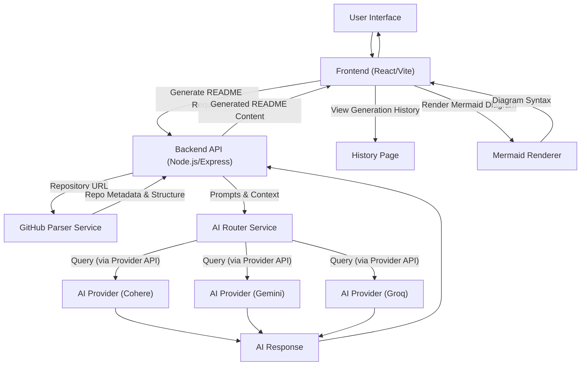

# ✨ AI-Powered README.md Generator

## Unleash Professional Documentation with Intelligent Automation

The `MetaKushal/readme-generator` is a sophisticated, AI-driven tool engineered to streamline the creation of high-quality, comprehensive `README.md` files for any software repository. By analyzing your project's structure and leveraging advanced Large Language Models (LLMs), this application delivers context-aware, well-structured, and technically accurate documentation, saving developers invaluable time and ensuring project clarity from the outset.

## Features

*   **AI-Powered Content Generation:** Harnesses leading AI models (Cohere, Gemini, Groq) to generate descriptive project overviews, installation guides, usage instructions, and more.
*   **Repository Analysis:** Intelligently parses repository structures, file trees, and inferred dependencies to inform README content.
*   **Multi-Provider AI Integration:** Configurable to use various AI service providers, offering flexibility and robustness.
*   **Interactive Frontend:** A intuitive web interface for submitting repository information and viewing generated READMEs.
*   **Mermaid Diagram Support:** Renders Mermaid diagrams within generated READMEs or for visualizing system architecture.
*   **Documentation History:** Keeps a record of previously generated READMEs for easy access and comparison.

## Architecture

The application follows a client-server architecture, comprising a React-based frontend and a Node.js/Express backend. The backend acts as an orchestration layer, interfacing with GitHub for repository analysis and various AI providers for content generation.

### System Diagram



### Key Components

*   **Frontend (`frontend/`):** Built with React, Vite, and Tailwind CSS. Provides the user interface for input, display of generated READMEs, and access to history. Includes a Mermaid renderer component.
*   **Backend (`backend/`):** A Node.js/Express server that exposes API endpoints.
    *   **`generateController.js`:** Handles the core logic for README generation requests.
    *   **`apiRoutes.js`:** Defines all API endpoints.
    *   **`githubParser.js`:** Service responsible for fetching and parsing repository data from GitHub.
    *   **`aiRouter.js`:** Orchestrates calls to different AI providers, potentially handling fallback or load balancing.
    *   **`prompts.js`:** Contains predefined prompts for various AI generation tasks.
    *   **`providers/`:** Directory housing specific integration modules for AI services (e.g., `cohere.js`, `gemini.js`, `groq.js`).

## Getting Started

Follow these instructions to set up and run the README.md Generator locally.

### Prerequisites

*   Node.js (LTS version recommended)
*   npm or Yarn package manager
*   Access to AI provider APIs (Cohere, Gemini, Groq) and a GitHub Personal Access Token (optional, for higher rate limits or private repos).

### Installation

Both the backend and frontend components have their own `package.json` files and require separate installation steps.

1.  **Clone the repository:**
    ```bash
    git clone https://github.com/MetaKushal/readme-generator.git
    cd readme-generator
    ```

2.  **Install Backend Dependencies:**
    Navigate to the `backend` directory and install its dependencies.
    ```bash
    cd backend
    npm install
    # or yarn install
    ```

3.  **Install Frontend Dependencies:**
    Navigate to the `frontend` directory and install its dependencies.
    ```bash
    cd ../frontend
    npm install
    # or yarn install
    ```

### Configuration

Environment variables are used to configure API keys for AI providers and optionally for GitHub. Create a `.env` file in the `backend` directory.

Example `backend/.env` file:

```env
# Server Port
PORT=3001

# AI Provider API Keys (use the one(s) you intend to enable)
COHERE_API_KEY="your_cohere_api_key_here"
GEMINI_API_KEY="your_gemini_api_key_here"
GROQ_API_KEY="your_groq_api_key_here"

# GitHub Token (optional, for increased rate limits or private repos)
# GITHUB_TOKEN="your_github_personal_access_token_here"
```

### Running the Application

Ensure both the backend and frontend are running simultaneously.

1.  **Start the Backend Server:**
    Navigate back to the `backend` directory and start the server.
    ```bash
    cd backend
    npm start
    # The backend server will typically run on http://localhost:3001
    ```

2.  **Start the Frontend Development Server:**
    Navigate to the `frontend` directory and start the development server.
    ```bash
    cd ../frontend
    npm run dev
    # The frontend application will typically open in your browser at http://localhost:5173 (or similar Vite default)
    ```

## Usage

1.  Open your web browser and navigate to the frontend application URL (e.g., `http://localhost:5173`).
2.  On the "Generator" page, input the URL of the GitHub repository for which you want to generate a `README.md`.
3.  Click the "Generate README" button. The application will process the request, interact with the AI, and display the generated README.
4.  Explore the "History" page to review previously generated documentation.

## Contributing

We welcome contributions! Please refer to our `CONTRIBUTING.md` (to be created) for guidelines on how to submit issues, features, or bug fixes.

## License

This project is licensed under the MIT License - see the `LICENSE` file (to be created) for details.

## Contact

For any inquiries or feedback, please open an issue in the GitHub repository or contact [MetaKushal](https://github.com/MetaKushal).